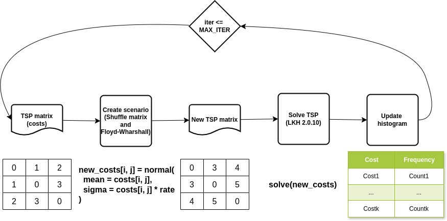
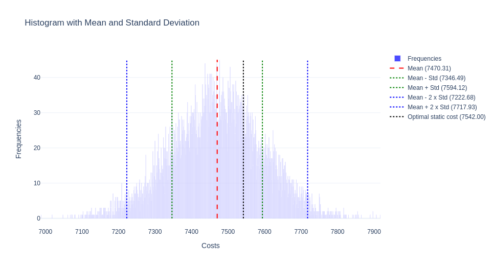

# Simulation + TSP

In this repo we explore the properties of the TSP with stochastic costs. Below we present the Flow Chart of the proposed algorithm.



To install the dependencies:

```sh
pip install -r requirements.txt
```

And below, we present a code snippet.

```py
from SimTSP import get_cost_matrix, simulate

instance_filename = "data/ch150.tsp"
orig_costs = get_cost_matrix(instance_filename)

# Parameters:
# - TSP matrix cost
# - STD rate
# - number of parallel simulations
# - number of parallel pools
histogram  = simulate(orig_costs, 0.1, 1000, 4) 
```

The file `SimTSP.ipynb` is a jupyter notebook script for plotting the histogram.


